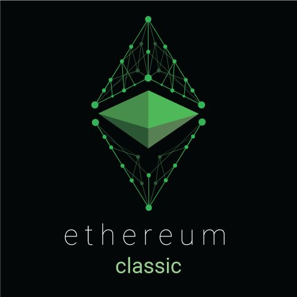
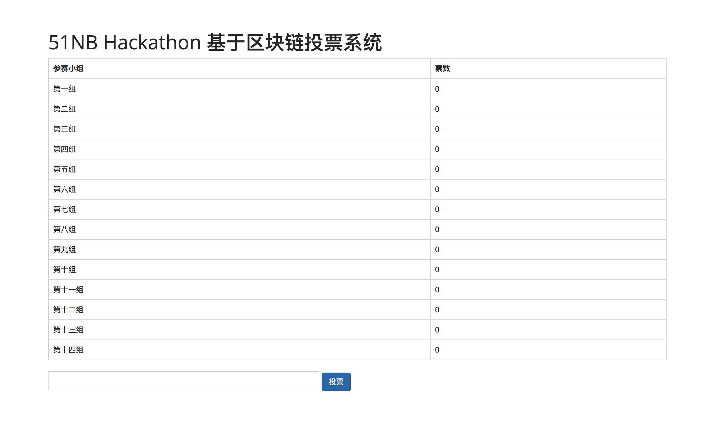
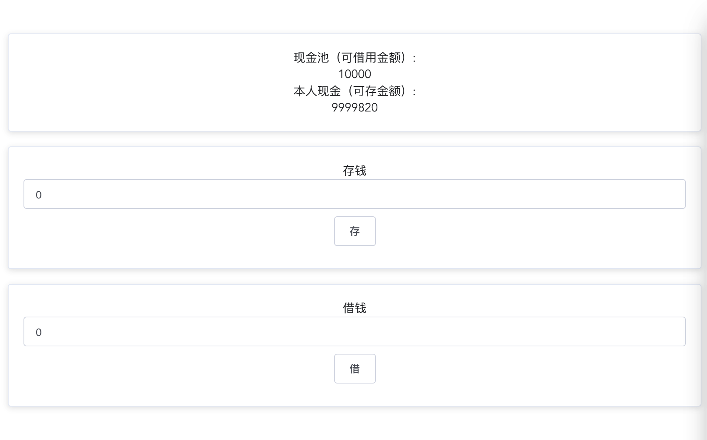

# 区块链的实际应用

## 目录

- 以太坊简介
- 基于以太坊的分布式投票系统
- 基于以太坊实现去中心化储蓄借贷系统

## 以太坊

是一个全新开放的区块链平台，它允许任何人在平台中建立和发布下一代分布式应用。

- 去中心化
- 分布式
- 智能合约
- 图灵完备

## 基于区块链的分布式投票系统

分布式、防篡改、完全透明的投票系统

## 基于区块链实现去中心化储蓄借贷系统

基于智能合约做的储蓄、贷款于一体的借贷系统
