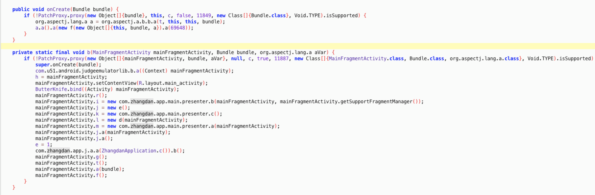

# Robust 坑和解

author: 王令龙 <wanglinglong@u51.com>

## 目录

- 基本原理
- 补丁包自动化生成流程
- 碰到的坑和解

## 基本原理


### 站桩输出

```
	public static ChangeQuickRedirect changeQuickRedirect;
    public void onCreate(Bundle bundle) {
        if (!PatchProxy.proxy(new Object[]{bundle}, this, changeQuickRedirect, false, 11849, new Class[]{Bundle.class}, Void.TYPE).isSupported) {
            JoinPoint makeJP = Factory.makeJP(ajc$tjp_0, this, this, bundle);
            MainFragmentActivity$$Injector.aspectOf().onCreate(new AjcClosure3(new Object[]{this, bundle, makeJP}).linkClosureAndJoinPoint(69648));
        }
    }
```

### 插代码插件

通过 Transform + javassist/ASM 修改 .class 文件

1. 注册 Tranfrom
2. 遍历 class
3. 规避不需要插入的方法
4. 写入 `public static ChangeQuickRedirect changeQuickRedirect` 变量;
5. 插入逻辑代码段，拦截原始逻辑
6. 写回 class，生成 methodsMap.robust 记录被修改的方法

### Tranform 执行顺序
按照 plugin 的声明顺序，顺序执行

```
TaskManager.java
/**
 * Creates the post-compilation tasks for the given Variant.
 *
 * These tasks create the dex file from the .class files, plus optional intermediary steps like
 * proguard and jacoco
 */
public void createPostCompilationTasks(
        @NonNull final VariantScope variantScope) {
    ...
    // ---- Code Coverage first -----
    ...
    // Merge Java Resources.
    createMergeJavaResTransform(variantScope);
    // ----- External Transforms -----
    // apply all the external transforms.
    List<Transform> customTransforms = extension.getTransforms();
    List<List<Object>> customTransformsDependencies = extension.getTransformsDependencies();
    for (int i = 0, count = customTransforms.size(); i < count; i++) {
        Transform transform = customTransforms.get(i);
        List<Object> deps = customTransformsDependencies.get(i);
        transformManager
                .addTransform(taskFactory, variantScope, transform)
                .ifPresent(
                        t -> {
                            if (!deps.isEmpty()) {
                                t.dependsOn(deps);
                            }
                            // if the task is a no-op then we make assemble task depend on it.
                            if (transform.getScopes().isEmpty()) {
                                variantScope.getAssembleTask().dependsOn(t);
                            }
                        });
    }
    ...
}
```

### 与 U51Logger 共存


### 与 aspectj 共存



### 与听云共存

- v2.5.x
- v2.8.x

#### 听云 v2.5.x


##### 听云 v2.8.x 


## 补丁包自动化生成流程

Robust 的精髓

### 主要流程

1. 读取被 @Add、@Modify、RobustModify.modify() 标注的方法或类并记录
2. 解析 mapping 文件并记录每个类和类中方法混淆前后对应的信息，其中方法存储的信息有：返回值，方法名，参数列表，混淆后的名字；字段存储的信息有：字段名，混淆后的名字
3. 根据得到的信息，generatPatch 方法实际生成补丁
4. 将生成的补丁class打包成jar包
5. jar -> dex
6. dex -> smali
7. 处理 smali，主要是处理 super 方法和处理混淆关系
8. smali -> dex
9. dex -> jar

### 

```
@Override
void transform(Context context, Collection<TransformInput> inputs, Collection<TransformInput> referencedInputs, TransformOutputProvider outputProvider, boolean isIncremental) throws IOException, TransformException, InterruptedException {
    project.android.bootClasspath.each {
        Config.classPool.appendClassPath((String) it.absolutePath)
    }
    def box = ReflectUtils.toCtClasses(inputs, Config.classPool)
    ...
    autoPatch(box)
    ...
}
def autoPatch(List<CtClass> box) {
    ...
    ReadAnnotation.readAnnotation(box, logger);
    if(Config.supportProGuard) {
        ReadMapping.getInstance().initMappingInfo();
    }
    generatPatch(box,patchPath);
    zipPatchClassesFile()
    executeCommand(jar2DexCommand)
    executeCommand(dex2SmaliCommand)
    SmaliTool.getInstance().dealObscureInSmali();
    executeCommand(smali2DexCommand)
    //package patch.dex to patch.jar
    packagePatchDex2Jar()
    deleteTmpFiles()
}
```

### 翻译-反射

- FieldAccess，字段访问操作 -> ReflectUtils.getFieldString
- NewExpr，new 对象操作 -> ReflectUtils.getNewInnerClassString/ReflectUtils.getCreateClassString
- Cast，强转操作 -> ReflectUtils.getCastString
- MethodCall，方法调用操作。情况比较复杂，以下几种情形
	- lamda表达式 -> ReflectUtils.getNewInnerClassString
	- 内联方法 -> ReflectUtils.getInLineMemberString 生成 xxInLinePatch
	- super方法 -> PatchesAssistFactory.createAssistClass  + ReflectUtils.invokeSuperString + smali 处理
	- 普通方法 -> ReflectUtils.getMethodCallString
- 生成补丁类并增加构造方法

### this 如何处理

- 实例方法自动携带 this 参数指向对象本身
- this.originClassPatch -> this.originClass
- PatchesFactory.createPatchClass() 生成转换方法

### 


```
public Object[] getRealParameter(Object[] objArr) {
    if (objArr == null || objArr.length < 1) {
        return objArr;
    }
    Object[] objArr2 = new Object[objArr.length];
    for (int i = 0; i < objArr.length; i++) {
        if (objArr[i] == this) {
            objArr2[i] = this.originClass;
        } else {
            objArr2[i] = objArr[i];
        }
    }
    return objArr2;
}
```

### super 如何处理

- 识别 super 方法，PatchesAssistFactory.createAssistClass 生成 originClassPatchRobustAssist 辅助类继承自原始类的父类
- Patch类中 super 方法 -> originClassPatchRobustAssist.staticRobustonCreate()
- smali 层替换 super 方法调用

#### 生成代码

```
MainFragmentActivity:
public void onCreate(Bundle bundle) {
    super.onCreate(bundle);
    ...
}
MainFragmentActivityPatch:
public static void staticRobustonCreate(MainFragmentActivityPatch mainFragmentActivityPatch, MainFragmentActivity mainFragmentActivity, Bundle bundle) {
    MainFragmentActivityPatchRobustAssist.staticRobustonCreate(mainFragmentActivityPatch, mainFragmentActivity, bundle);
}
MainFragmentActivityPatchRobustAssist:
public class MainFragmentActivityPatchRobustAssist extends WrapperAppCompatFragmentActivity {
    public static void staticRobustonCreate(MainFragmentActivityPatch mainFragmentActivityPatch, MainFragmentActivity mainFragmentActivity, Bundle bundle) {
        mainFragmentActivityPatch.onCreate(bundler);
    }
}
```

#### smali 处理

smali 是 dex 文件反编译出来可读的用于描述 Android 虚拟机字节码的文件格式

- .class -> javap 工具生成可读的文件
- .dex -> baksmali 工具生成可读的 smali 文件


```
private String invokeSuperMethodInSmali(final String line, String fullClassName) {
    ...
    result = line.replace(Constants.SMALI_INVOKE_VIRTUAL_COMMAND, Constants.SMALI_INVOKE_SUPER_COMMAND);
    ...
    result = result.replace("p0", "p1");
    ...
}

invoke-invoke-virtual {p0, p2}, Lcom/meituan/robust/patch/SecondActivityPatch; ->
onCreate(Landroid/os/Bundle;)V` -> `invoke-super {p1, p2}, Landroid/support/v7/app/AppCompatActivity;->onCreate(Landroid/os/Bundle;)V
```

### 内联如何处理

- 泛指在编译期做的改变方法签名的操作
- 标识修改的方法：@Modify -> RobustModify.modify()
- 缺啥补啥：MethodCall -> repalceInlineMethod() -> ReflectUtils.getInLineMemberString()

## 碰到的坑和解

### 打补丁包出错？

- execute command java -jar /robust/dx.jar --dex --output=classes.dex meituan.jar error
- Mac JDK 的一个bug，升级修复

### Robust 定义的 API 不够用怎么办？

重写之

### 与 Aspectj 冲突怎么办？

`Caused by: java.lang.ClassCastException: MainFragmentActivityPatch cannot be cast to MainFragmentActivity`

#### Aspectj 的调用流程

```
MainFragmentActivity.onCreate -> 
MainFragmentActivity$$Injector.onCreate(ProceedingJoinPoint joinPoint) -> 
ProceedingJoinPoint.proceed() -> 
AroundClosure.run(Object[] args) ->  
MainFragmentActivity$AjcClosure3.run(Object[] objArr) -> 
MainFragmentActivity.onCreate_aroundBody2((MainFragmentActivity) objArr2[0], (Bundle) objArr2[1], (JoinPoint) objArr2[2]); -> 
MainFragmentActivity.onCreate_aroundBody1$advice -> 
MainFragmentActivity.onCreate_aroundBody0();
```

#### this 转换错误

```
Object[] objArr = new Object[]{this, savedInstanceState, joinPoint};
Object obj2 = (AjcClosure3) EnhancedRobustUtils.invokeReflectConstruct("com.zhangdan.app.activities.MainFragmentActivity$AjcClosure3", getRealParameter(new Object[]{objArr}), new Class[]{Object[].class});
```
- 一个含有3个对象的一维数据 -> 含有一个对象的二维数组
- getRealParameter 不支持多维数组
- [merge request #259](https://github.com/Meituan-Dianping/Robust/pull/259)

### static 方法中包含 super 方法怎么办？

- Caused by: javassist.CannotCompileException: [source error] not-available: this
- [merge request #265](https://github.com/Meituan-Dianping/Robust/pull/265)

## 文章

- [Android热补丁之Robust原理解析(一)](http://w4lle.com/2017/03/31/robust-0/)
- [Android热补丁之Robust（二）自动化补丁原理解析](http://w4lle.com/2018/05/28/robust-1/)
- [Android热补丁之Robust（三）坑和解](http://w4lle.com/2018/06/20/robust-2/)

## Thanks
**Q & A**